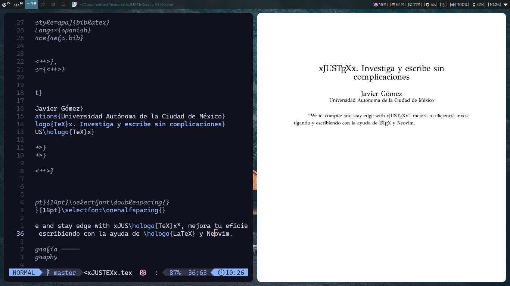
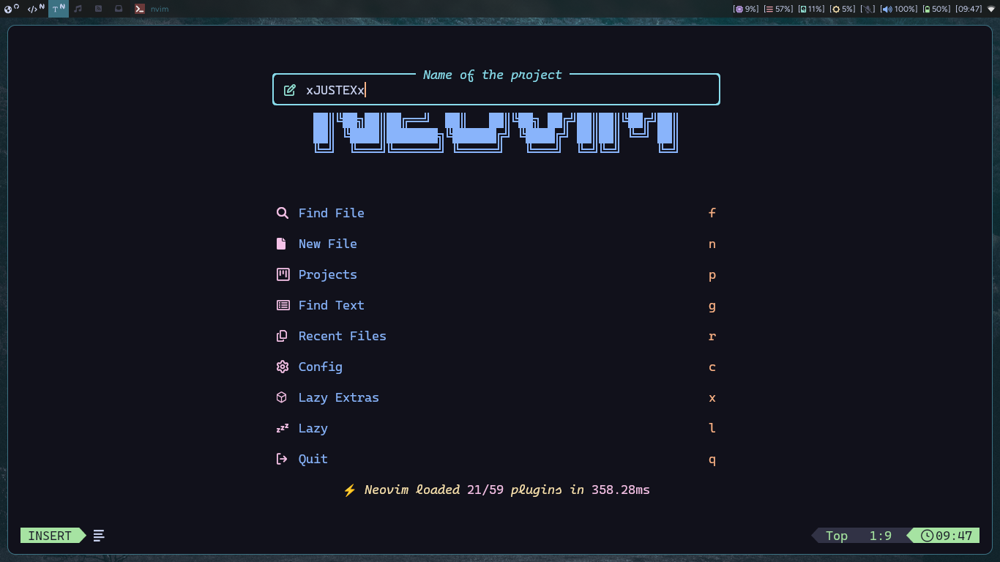
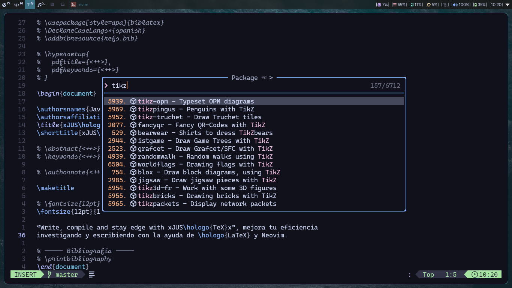
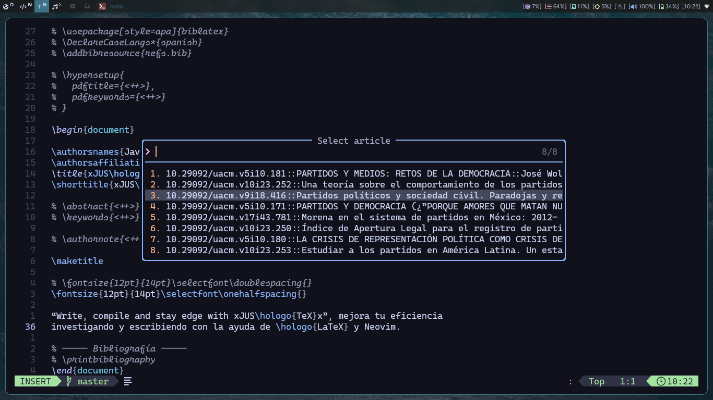
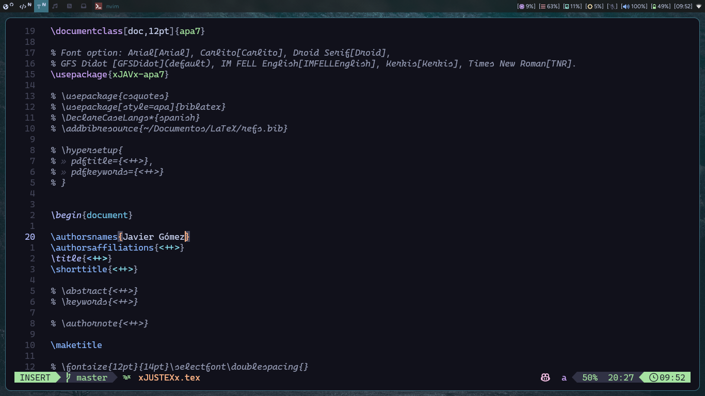
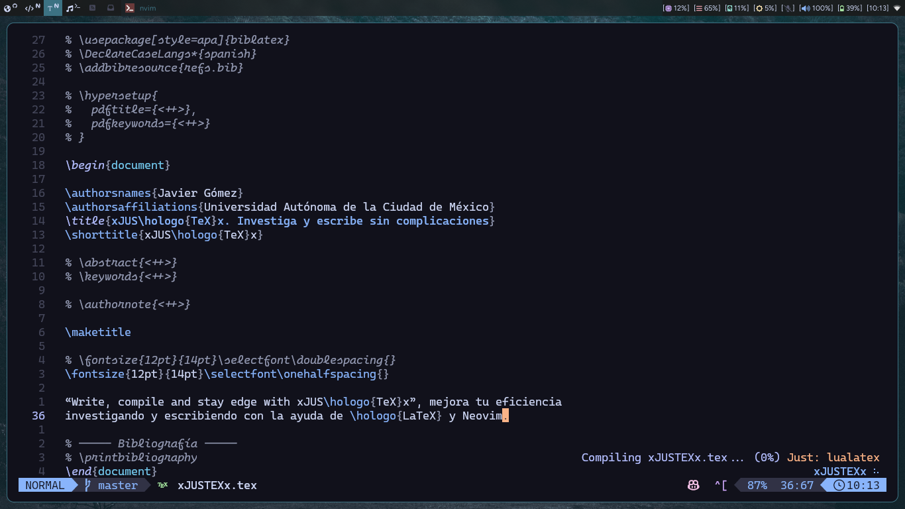

# xJUSTEXx



Hice este plugin con la idea de facilitar la creación de mis ensayos con LaTeX
a través de Neovim. Mezclo la creación de proyectos (una estructura básica de
workspace e inicialización de repositorio git) con el fácil acceso a los
comandos de TeXlive para compilar a través Just y justfile.

I made this plugin with the idea of create project articleas easy with LaTeX
and Neovim. This plugin create a project directory with the name of the
project, a main.tex and a .justfile for compile.

## Tabla de Contenidos

- [Dependencias](#dependencias)
- [Instalación](#install)
- [Configuración](#configuration)
- [Uso](#use)
- [Opciones de Configuración](#change-default-configuration)
- [Contribuciones](#contribuciones)

## Dependencias

- Neovim >= 0.10
- Git
- Just
- Zathura
- plenary.nvim
- fidget.nvim (opcional)

## Install

Para instalar puedes usar el plugin manager que prefieras. El siguiente ejemplo
es con [lazy.nvim](https://github.com/folke/lazy.nvim) y depende opcionalmente
de [fidget.nvim](https://github.com/j-hui/fidget.nvim) para conocer el status
de la compilación. Si no se cuenta con fidget, vim.notify se usará en su lugar.

To install you can use the plugin manager you prefer. The following example is
with [lazy.nvim](https://github.com/folke/lazy.nvim) and depends optionally on
[fidget.nvim](https://github.com/j-hui/fidget.nvim) to know the status of
compilation. If you do not have fidget, vim.Notify will be used instead.

```lua
{
  "frvnzj/xJUSTEXx.nvim",
  dependencies = {
    {
      "j-hui/fidget.nvim",
      opts = {},
    },
    {
      "nvim-lua/plenary.nvim"
    },
  },
  config = function()
    require("xJUSTEXx").setup()
  end,
}

-- or if you are a noice.nvim user

{
  {
    "frvnzj/xJUSTEXx.nvim",
    dependencies = {
      "nvim-lua/plenary.nvim"
    },
    config = function()
      require("xJUSTEXx").setup()
    end,
  },
  {
    "j-hui/fidget.nvim",
    opts = {},
    ft = { "tex", "plaintex" },
  },
}

```

## Configuration

La configuración tiene tres opciones (definición de los directorios de los
proyectos, plantillas o contenidos con el que se iniciará el main tex y el
contenido del .justfile que declara los comandos a usar). Las opciones por
default son las siguientes:

The configuration have three options (project directories, templates for main
tex and the content of .justfile with the commands for compile). The default
setup is:

```lua
{
  project_dirs = {
    vim.fn.expand('$HOME') .. '/Documents/xJUSTEXx/Articles',
    vim.fn.expand('$HOME') .. '/Documents/xJUSTEXx/Research',
  },
  tex_templates = {
    article = {
      name = 'Article',
      content = [[
\documentclass{article}


\begin{document}

\title{Title}
\author{Author}
\date{\today}
\maketitle


\section{Introduction}

This is an article template.


\end{document}
      ]],
    },
    book = {
      name = 'Book',
      content = [[
\documentclass{book}


\begin{document}

\title{Title}
\author{Author}
\date{\today}
\maketitle


\chapter{Introduction}

This is a book template.


\end{document}
      ]],
    },
    presentation = {
      name = 'Presentation',
      content = [[
\documentclass{beamer}


\begin{document}
\title{Title}
\author{Author}
\date{\today}
\frame{\titlepage}


\begin{frame}
\frametitle{Introduction}

This is a presentation template.

\end{frame}


\end{document}
      ]],
    },
  },
  justfile_content = [[
main_file := "%s.tex"

lualatex:
  @latexmk -lualatex -interaction=nonstopmode -synctex=-1 {{main_file}}

pdflatex:
  @latexmk -pdf -interaction=nonstopmode -synctex=-1 {{main_file}}

pdfxe:
  @latexmk -pdfxe -interaction=nonstopmode -synctex=-1 {{main_file}}

cleanmain:
  @latexmk -c {{main_file}}

cleanall:
  @latexmk -c
]],
}
```

## Use







xJUSTEXx ofrece siete comandos:

- **JustexNewProject**: crea un proyecto nuevo (directorio del proyecto,
  repositorio Git y tex file con el nombre del proyecto).

- **JustexCompile**: compila utilizando optativamente LuaLaTeX, pdfLaTeX o
  XeLaTeX (dependiendo de tu `justfile_content`) con la ayuda/dependencia de
  [Just](https://github.com/casey/just).

  - `:JustexCompile lualatex`
  - `:JustexCompile pdflatex`
  - `:JustexCompile pdfxe`
  - `:JustexCompile cleanmain`
  - `:JustexCompile cleanall`

- **JustexSearchCTAN**: enlista todos los paquetes de CTAN para buscar
  documentación. Los PDF's se abrirán en Zathura, la documentación HTMl en el
  navegador y los archivos de texto en Neovim, estos últimos se descargarán al
  caché, `stdpath('cache')`.

- **JustexDoc**: abre la documentación del package bajo el cursor con el uso de texdoc.

- **JustexLog**: abre el logfile para visualizar errores (requiere pplatex).

- **JustexSearchBook**: busca referencias con ISBN y las añade al archivo
  refs.bib, que se creará automáticamente en el directorio raíz del proyecto, al
  confirmar la entrada.

  > [!IMPORTANT]
  > Para buscar las referencias bibliográficas, el plugin hace uso del api de
  > Open Library, por lo que algunas referencias pueden no ser encontradas o
  > algunos campos pueden estar vacíos y tendrán que definirse manualmente. Por
  > ahora sólo busca referencias de libros.

- **JustexSearchJournal**: busca referencias por medio de CrossRef, tiene mayor
  versatilidad este comando gracias a su API y por el mismo índice de revistas
  académicas.

  > [!IMPORTANT]
  > Comienza por hacer la búsqueda de la revista académica, ya sea por palabras
  > clave o por el ISSN; después, busca artículos por palabras clave. Del
  > artículo seleccionado podrás agregar la referencia en formato biblatex en el
  > archivo refs.bib (se creará automáticamente), podrás seleccionar abrir el PDF
  > del artículo en Zathura (es el único viewer configurado por ahora) o
  > descargar el EPUB en ~/Downloads (la accesibilidad a PDF's o EPUB's depende
  > de la disponibilidad de las revistas).

---

xJUSTEXx offers seven commands:

- **JustexNewProject**: Create a new project (Project Board, Git repository and
  Tex File with the name of the project).

- **JustexCompile**: Compila using optionally LuaLaTeX, pdfLaTeX or XeLaTeX
  (depending on your `justfile_content`) with
  [Just's](https://github.com/casey/just) help.

  - `:JustexCompile lualatex`
  - `:JustexCompile pdflatex`
  - `:JustexCompile pdfxe`
  - `:JustexCompile cleanmain`
  - `:JustexCompile cleanall`

- **JustexSearchCTAN**: List all CTAN packages to search for documentation. The
  PDF's will open in Zathura, the HTML documentation in the browser and the text
  files in Neovim, the latter will be downloaded to the cache, `stdpath
('cache')`.

- **JustexDoc**: Open the Package documentation under the cursor with the use
  of Texdoc.

- **JustexLog**: Open the logfile to visualize errors (requires pplatex).

- **JustexSearchBook**: Look for references with ISBN and add them to the
  refs.bib file, which will be automatically created in the root directory of the
  project, confirming the entrance.

  > [!IMPORTANT]
  > To look for bibliographic references, the plugin makes use of the Open
  > Library API, so some references may not be found or some fields may be
  > empty and will have to be defined manually. For now it only looks for book
  > references.

- **JustexSearchJournal**: Look for references through Crossref, this command
  has greater versatility thanks to its API and the same index of academic
  magazines.

  > [!IMPORTANT]
  > It begins by searching the academic magazine, either by keywords or by the
  > ISSN; Then, look for articles by keywords. From the selected article you can
  > add the reference in the Bibliatex format in the refs.bib file (it will be
  > created automatically), you can select to open the PDF of the article in
  > Zathura (it is the only viewer configured for now) or download the epub in
  > ~/Downloads (accessibility to PDF's or EPUB's depends on the availability of
  > magazines).

## Change default configuration



La configuración no se limita a las 3 opciones disponibles a modificar del
plugin. Por ejemplo, la configuración de uso personal para iniciar proyectos de
ensayo:

You can change the default configuration, for example, I set my own template
and directories:

```lua
require("xJUSTEXx").setup({
  tex_templates = {
    article = {
      name = "Article",
      content = [[
\documentclass[doc,12pt]{apa7}

% Font option: Arial[Arial], Carlito[Carlito], Droid Serif[Droid],
% GFS Didot [GFSDidot](default), IM FELL English[IMFELLEnglish], Kerkis[Kerkis], Times New Roman[TNR].
\usepackage{xJAVx-apa7}

\addbibresource{~/Documentos/LaTeX/refs.bib}

% \hypersetup{
%  pdftitle={<++>},
%  pdfkeywords={<++>}
% }


\begin{document}

\authorsnames{<++>}
\authorsaffiliations{<++>}
\title{<++>}
\shorttitle{<++>}

% \abstract{<++>}
% \keywords{<++>}

% \authornote{<++>}

\maketitle

% \fontsize{12pt}{14pt}\selectfont\doublespacing{}
\fontsize{12pt}{14pt}\selectfont\onehalfspacing{}

<++>


% ----- Bibliografía -----
% \printbibliography
\end{document}]],
    },
  },
  project_dirs = {
    vim.fn.expand("$HOME") .. "/Documentos/Ensayos",
    "~/Documentos/Research",
    "/home/$USER/Documentos/Presentations"
  },
})
```

También puedes definir tu propia plantilla siguiendo la tabla de `tex_templates`:

Also you can define your own template following the table of `tex_templates`:

```lua
tex_templates = {
    myTemplate = {
        name = 'MyTemplate',
        content = [[
This is MyTemplate]],
    },
},
```

---



También es recomendable el uso de
[which-key](https://github.com/folke/which-key.nvim) o nvim_set_keymap() en
`ftplugin/tex.lua` y `ftplugin/plaintex.lua`, por ejemplo:

It is also recommended to use
[which-key](https://github.com/folke/which-key.nvim) or nvim_set_keymap() in
`ftplugin/tex.lua` y `ftplugin/plaintex.lua`, for example:

```lua
local wk = require("which-key")

wk.add({
  { "<leader>wa", "<cmd>JustexCompile lualatex<cr>", desc = "xJAVx LuaLaTeX", icon = { icon = "", color = "azure" } },
  { "<leader>wb", "<cmd>JustexCompile pdflatex<cr>", desc = "xJAVx LaTeX", icon = { icon = "", color = "azure" } },
  { "<leader>wc", "<cmd>JustexCompile pdfxe<cr>", desc = "xJAVx XeLaTeX", icon = { icon = "", color = "azure" } },
})

vim.keymap.set("n", "<leader>wd", function()
  require("xJUSTEXx").xCOMPILEx("cleanmain")
end, { noremap = true, silent = true })

vim.keymap.set("n", "<leader>wl", function()
  require("xJUSTEXx").xPPLATEXx()
end, { noremap = true, silent = true })

vim.keymap.set("n", "<leader>wT", function()
  require("xJUSTEXx").xTEXDOCx()
end, { noremap = true, silent = true })

-- Estos keymaps permiten ir rápidamente a los sitios que quiero modificar,
-- por ejemplo, en \authorsnames{<++>} me lleva dentro de { } borrando <++>
-- permitiéndome ingresar el nombre \authorsnames{xJAVx}
vim.keymap.set("n", ",,", "<cmd>keepp /<++><cr>ca<", { noremap = true, silent = true })
vim.keymap.set("i", ",,", "<esc>0<cmd>keepp /<++><cr>ca<", { noremap = true, silent = true })
```

## Contribuciones

Si deseas contribuir mejorando el plugin o reportar errores, quedo atento.

### License MIT
