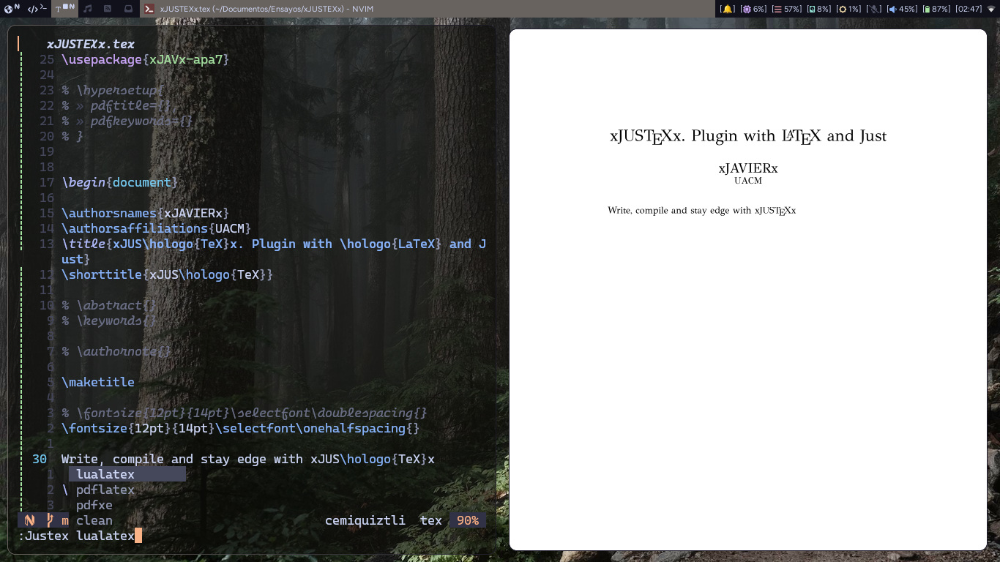
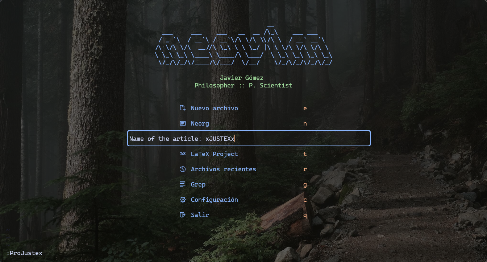
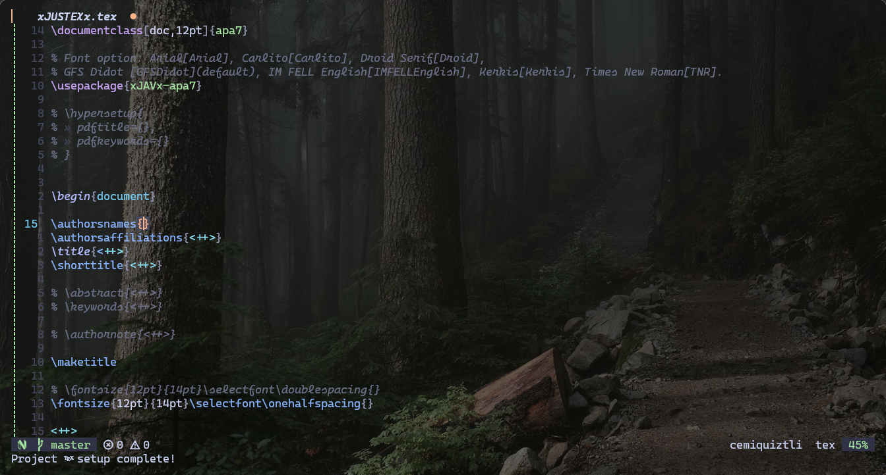

# xJUSTEXx



Hice este plugin con la idea de facilitar la creación de mis ensayos con LaTeX
a través de Neovim. Mezclo la creación de proyectos (una estructura básica de
workspace e inicialización de repositorio git) con el fácil acceso a los
comandos de TeXlive para compilar a través Just y justfile.

I made this plugin with the idea of create project articleas easy with LaTeX
and Neovim. This plugin create a project directory with the name of the
project, a main.tex and a .justfile for compile.

## Tabla de Contenidos

- [Dependencias](#dependencias)
- [Instalación](#instalación)
- [Configuración](#configuración)
- [Uso](#uso)
- [Comandos](#comandos)
- [Opciones de Configuración](#opciones-de-configuración)
- [Contribuciones](#contribuciones)

## Dependencias

- Neovim >= 0.10
- Git
- Just
- fidget.nvim (opcional)
- [texclear](https://github.com/LukeSmithxyz/voidrice/blob/master/.local/bin/texclear)
  (opcional)

## Instalación / Install

Para instalar puedes usar el plugin manager que prefieras. El siguiente ejemplo
es con [lazy.nvim](https://github.com/folke/lazy.nvim) y depende de
[fidget.nvim](https://github.com/j-hui/fidget.nvim) para conocer el status de
la compilación.

```lua
{
  "frvnzj/xJUSTEXx.nvim",
  dependencies = {
    {
      "j-hui/fidget.nvim",
      opts = {},
    },
  },
  config = function()
    require("xJUSTEXx").setup()
  end,
}

-- or if you are a noice.nvim user

{
  {
    "frvnzj/xJUSTEXx.nvim",
    dependencies = {
      "j-hui/fidget.nvim",
    },
    config = function()
      require("xJUSTEXx").setup()
    end,
  },
  {
    "j-hui/fidget.nvim",
    opts = {},
    ft = { "tex", "plaintex" },
  },
}

```

## Configuración / Configuration

La configuración tiene tres opciones (definición de los directorios de los
proyectos, plantillas o contenidos con el que se iniciará el main tex y el
contenido del .justfile que declara los comandos a usar). Las opciones por
default son las siguientes:

The configuration have three options (project directories, templates for main
tex and the content of .justfile with the commands for compile). The default
setup is:

```lua
{
  project_dirs = {
    vim.fn.expand('$HOME') .. '/Documents/xJUSTEXx/Articles',
    vim.fn.expand('$HOME') .. '/Documents/xJUSTEXx/Research',
  },
  tex_templates = {
    article = {
      name = 'Article',
      content = [[
\documentclass{article}


\begin{document}

\title{Title}
\author{Author}
\date{\today}
\maketitle


\section{Introduction}

This is an article template.


\end{document}
      ]],
    },
    book = {
      name = 'Book',
      content = [[
\documentclass{book}


\begin{document}

\title{Title}
\author{Author}
\date{\today}
\maketitle


\chapter{Introduction}

This is a book template.


\end{document}
      ]],
    },
    presentation = {
      name = 'Presentation',
      content = [[
\documentclass{beamer}


\begin{document}
\title{Title}
\author{Author}
\date{\today}
\frame{\titlepage}


\begin{frame}
\frametitle{Introduction}

This is a presentation template.

\end{frame}


\end{document}
      ]],
    },
  },
  justfile_content = [[
main_file := "%s.tex"

lualatex:
  @latexmk -lualatex -interaction=nonstopmode -synctex=-1 {{main_file}}

pdflatex:
  @latexmk -pdf -interaction=nonstopmode -synctex=-1 {{main_file}}

pdfxe:
  @latexmk -pdfxe -interaction=nonstopmode -synctex=-1 {{main_file}}

cleanmain:
  @latexmk -c {{main_file}}

cleanall:
  @latexmk -c
]],
}
```

## Uso / Use



xJUSTEXx ofrece tres comandos:

- **JustexNewProject**: crea un proyecto nuevo (directorio del proyecto,
  repositorio Git y tex file con el nombre del proyecto).

- **JustexCompile**: compila utilizando optativamente LuaLaTeX, pdfLaTeX o
  XeLaTeX (dependiendo de tu `justfile_content`) con la ayuda/dependencia de
  [Just](https://github.com/casey/just).

  - `:JustexCompile lualatex`
  - `:JustexCompile pdflatex`
  - `:JustexCompile pdfxe`
  - `:JustexCompile cleanmain`
  - `:JustexCompile cleanall`

- **JustexDoc**: abre la documentación del package bajo el cursor con el uso de texdoc.

- **JustexLog**: abre el logfile para visualizar errores (requiere pplatex).

---

xJUSTEXx offers three commands:

- **JustexNewProject**: Create a new project (Project Board, Git repository and
  Tex File with the name of the project).

- **JustexCompile**: Compila using optionally LuaLaTeX, pdfLaTeX or XeLaTeX
  (depending on your `justfile_content`) with
  [Just's](https://github.com/casey/just) help.

  - `:JustexCompile lualatex`
  - `:JustexCompile pdflatex`
  - `:JustexCompile pdfxe`
  - `:JustexCompile cleanmain`
  - `:JustexCompile cleanall`

- **JustexDoc**: Open the Package documentation under the cursor with the use
  of Texdoc.

- **JustexLog**: Open the logfile to visualize errors (requires pplatex).

## Opciones de Configuración / Change default configuration



La configuración no se limita a las 3 opciones disponibles a modificar del
plugin. Por ejemplo, la configuración de uso personal para iniciar proyectos de
ensayo:

You can change the default configuration, for example, I set my own template
and directories:

```lua
require("xJUSTEXx").setup({
  tex_templates = {
    article = {
      name = "Article",
      content = [[
\documentclass[doc,12pt]{apa7}

% Font option: Arial[Arial], Carlito[Carlito], Droid Serif[Droid],
% GFS Didot [GFSDidot](default), IM FELL English[IMFELLEnglish], Kerkis[Kerkis], Times New Roman[TNR].
\usepackage{xJAVx-apa7}

\addbibresource{~/Documentos/LaTeX/refs.bib}

% \hypersetup{
%  pdftitle={<++>},
%  pdfkeywords={<++>}
% }


\begin{document}

\authorsnames{<++>}
\authorsaffiliations{<++>}
\title{<++>}
\shorttitle{<++>}

% \abstract{<++>}
% \keywords{<++>}

% \authornote{<++>}

\maketitle

% \fontsize{12pt}{14pt}\selectfont\doublespacing{}
\fontsize{12pt}{14pt}\selectfont\onehalfspacing{}

<++>


% ----- Bibliografía -----
% \printbibliography
\end{document}]],
    },
  },
  project_dirs = {
    vim.fn.expand("$HOME") .. "/Documentos/Ensayos",
    "~/Documentos/Research",
    "/home/$USER/Documentos/Presentations"
  },
})
```

También puedes definir tu propia plantilla siguiendo la tabla de `tex_templates`:

Also you can define your own template following the table of `tex_templates`:

```lua
tex_templates = {
    myTemplate = {
        name = 'MyTemplate',
        content = [[
This is MyTemplate]],
    },
},
```

---


También es recomendable el uso de [which-key](https://github.com/folke/which-key.nvim) o nvim_set_keymap() en `ftplugin/tex.lua` y `ftplugin/plaintex.lua`, por ejemplo:

It is also recommended to use [which-key](https://github.com/folke/which-key.nvim) or nvim_set_keymap() in `ftplugin/tex.lua` y `ftplugin/plaintex.lua`, for example:

```lua
local wk = require("which-key")

wk.add({
  { "<leader>wa", "<cmd>JustexCompile lualatex<cr>", desc = "xJAVx LuaLaTeX", icon = { icon = "", color = "azure" } },
  { "<leader>wb", "<cmd>JustexCompile pdflatex<cr>", desc = "xJAVx LaTeX", icon = { icon = "", color = "azure" } },
  { "<leader>wc", "<cmd>JustexCompile pdfxe<cr>", desc = "xJAVx XeLaTeX", icon = { icon = "", color = "azure" } },
})

vim.keymap.set("n", "<leader>wd", function()
  require("xJUSTEXx").xCOMPILEx("cleanmain")
end, { noremap = true, silent = true })

vim.keymap.set("n", "<leader>wl", function()
  require("xJUSTEXx").xPPLATEXx()
end, { noremap = true, silent = true })

vim.keymap.set("n", "<leader>wT", function()
  require("xJUSTEXx").xTEXDOCx()
end, { noremap = true, silent = true })

-- Estos keymaps permiten ir rápidamente a los sitios que quiero modificar,
-- por ejemplo, en \authorsnames{<++>} me lleva dentro de { } borrando <++>
-- permitiéndome ingresar el nombre \authorsnames{xJAVx}
vim.keymap.set("n", ",,", "<cmd>keepp /<++><cr>ca<", { noremap = true, silent = true })
vim.keymap.set("i", ",,", "<esc>0<cmd>keepp /<++><cr>ca<", { noremap = true, silent = true })
```

## Contribuciones

Si deseas contribuir mejorando el plugin o reportar errores, quedo atento.

### License MIT
